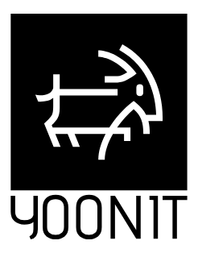
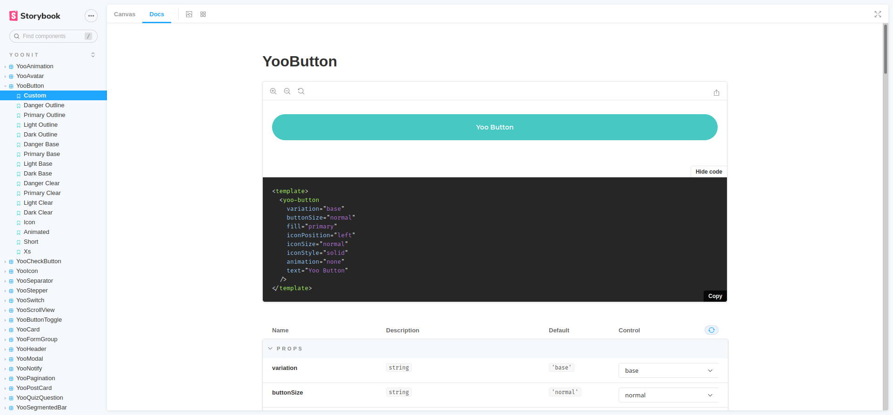

<h1 align="center">Vue Yoonit Components</h1>

<p align="center">
    
    
	
	
	
</p>
<p align="center">The Atomic Design System framework</p>

<div align="center">
	<table>
		<tbody>
			<tr>
				<td align="left" valign="middle">
                    <p>◻ 26 Vue Components to create modern UI's</p>
                    <p>◻ Grid and Flex layout components</p>
                    <p>◻ Unit tests with 100% coverage</p>
                    <p>◻ All components documented with Storybook</p>
                    <p>◻ Standardized code</p>
                    <p>◻ Consistency between interfaces</p>
                    <p>◻ The extended definition of Atomic Design including Bosons and Quarks</p>
                    <p>◻ SASS with BEM</p>
                    <p>◻ Fully customizable with themes provided by <a src="https://github.com/Yoonit-Labs/sass-yoonit-style">@yoonit/style</a></p>
				</td>
				<td align="center" valign="middle">
					
				</td>
			</tr>
		<tbody>
	</table>
</div>

<div align="center">
	<h3>Sponsors</h3>
	<table align="center">
		<tbody align="center">
			<tr>
				<td>
					<b>Platinum</b>
				</td>
			</tr>
			<tr>
				<td align="center" valign="middle">
					<a href="https://cyberlabs.ai"></a>
				</td>
			</tr>
		</tbody>
	</table>
	<h5><a href="mailto:about@yoonit.dev">Become a sponsor!</a></h5>
</div>

### [Atoms](#atoms)
* [YooAnimation](https://github.com/Yoonit-Labs/vue-yoonit-components/tree/development/src/components/atoms/Animation)
* [YooAvatar](https://github.com/Yoonit-Labs/vue-yoonit-components/tree/development/src/components/atoms/Avatar)
* [YooButton](https://github.com/Yoonit-Labs/vue-yoonit-components/tree/development/src/components/atoms/Button)
* [YooCheckButton](https://github.com/Yoonit-Labs/vue-yoonit-components/tree/development/src/components/atoms/CheckButton)
* [YooDropdown](https://github.com/Yoonit-Labs/vue-yoonit-components/tree/development/src/components/atoms/DropDown)
* [YooIcon](https://github.com/Yoonit-Labs/vue-yoonit-components/tree/development/src/components/atoms/Icon)
* [YooSelectDate](https://github.com/Yoonit-Labs/vue-yoonit-components/tree/development/src/components/atoms/SelectDate)
* [YooStepper](https://github.com/Yoonit-Labs/vue-yoonit-components/tree/development/src/components/atoms/Stepper)
* [YooSwitch](https://github.com/Yoonit-Labs/vue-yoonit-components/tree/development/src/components/atoms/Switch)
### [Molecules](#molecules)
* [YooButtonToggle](https://github.com/Yoonit-Labs/vue-yoonit-components/tree/development/src/components/molecules/ButtonToggle)
* [YooCard](https://github.com/Yoonit-Labs/vue-yoonit-components/tree/development/src/components/molecules/Card)
* [YooFormGroup](https://github.com/Yoonit-Labs/vue-yoonit-components/tree/development/src/components/molecules/FormGroup)
* [YooHeader](https://github.com/Yoonit-Labs/vue-yoonit-components/tree/development/src/components/molecules/Header)
* [YooListItem](https://github.com/Yoonit-Labs/vue-yoonit-components/tree/development/src/components/molecules/ListItem)
* [YooModal](https://github.com/Yoonit-Labs/vue-yoonit-components/tree/development/src/components/molecules/Modal)
* [YooNotify](https://github.com/Yoonit-Labs/vue-yoonit-components/tree/development/src/components/molecules/Notify)
* [YooPagination](https://github.com/Yoonit-Labs/vue-yoonit-components/tree/development/src/components/molecules/Pagination)
* [YooQuizQuestion](https://github.com/Yoonit-Labs/vue-yoonit-components/tree/development/src/components/molecules/QuizQuestion)
* [YooSegmentedBar](https://github.com/Yoonit-Labs/vue-yoonit-components/tree/development/src/components/molecules/SegmentedBar)
* [YooSelectButton](https://github.com/Yoonit-Labs/vue-yoonit-components/tree/development/src/components/molecules/SelectButton)
* [YooTableAttribute](https://github.com/Yoonit-Labs/vue-yoonit-components/tree/development/src/components/molecules/TableAttribute)
### [Bosons](#bosons)
* [YooFlexLayout](https://github.com/Yoonit-Labs/vue-yoonit-components/tree/development/src/components/bosons/FlexLayout)
* [YooGridLayout](https://github.com/Yoonit-Labs/vue-yoonit-components/tree/development/src/components/bosons/GridLayout)
* [YooScrollView](https://github.com/Yoonit-Labs/vue-yoonit-components/tree/development/src/components/bosons/ScrollView)
### [Quarks](#quarks)
* [YooIndicator](https://github.com/Yoonit-Labs/vue-yoonit-components/tree/development/src/components/quarks/Indicator)

## Installation

```javascript
npm i -s @yoonit/vue-components
```

## Usage

#### VueJS Plugin

To use the components, import the library into your project's main.js file.

`main.js`
```javascript
import Vue from 'vue'
import YoonitVueComponents from '@yoonit/vue-components'

Vue.use(YoonitVueComponents)
```

After that, you can access each component by calling it in the html template. It is not necessary to import manually each component in your template.

## StoryBook

To see all the components, run the Storybook available in this project. 

```javascript
npm run storybook
```
After running the command above, an address will be available for you to access the component library. There you will be able to meet, interact and copy the code ready to put in your project.



## To contribute and make it better

Clone the repo, change what you want and send PR.
For commit messages we use <a href="https://www.conventionalcommits.org/">Conventional Commits</a>.

Contributions are always welcome!

<a href="https://github.com/Yoonit-Labs/vue-yoonit-components/graphs/contributors">
  
</a>
  
---  

Code with ❤ by the [**Yoonit**](https://yoonit.dev/) Team
