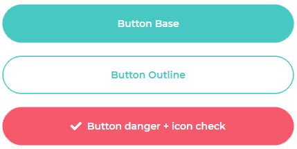

# Yoonit Components

[Home](https://github.com/Yoonit-Labs/vue-yoonit-components/blob/development/README.md) | [Atoms](https://github.com/Yoonit-Labs/vue-yoonit-components/blob/development/README.md#atoms) | [Molecules](https://github.com/Yoonit-Labs/vue-yoonit-components/blob/development/README.md#molecules) | [Bosons](https://github.com/Yoonit-Labs/vue-yoonit-components/blob/development/README.md#bosons) | [Quarks](https://github.com/Yoonit-Labs/vue-yoonit-components/blob/development/README.md#quarks)

## YooButton

The component is used to illustrate a user and displays the profile picture or the beginning of the word

## Usage

To use the component, simply invoke it in your template with the desired props

### Input
`App.vue`
```vue
<template>
  <yoo-button
    variation="base"
    buttonSize="normal"
    fill="primary"
    animation="none"
    text="Button Base"
  />
  
  <yoo-button
    variation="outline"
    buttonSize="normal"
    fill="primary"
    animation="none"
    text="Button Outline"
  />
  
  <yoo-button
    variation="base"
    buttonSize="normal"
    fill="danger"
    icon="check"
    iconPosition="left"
    iconSize="normal"
    iconStyle="solid"
    animation="none"
    text="Button danger + icon check"
  />
</template>
```
### Output

The output of the above code will be:



### Props

| Parameter          | Type    | Default | Valid values                              | Description                                    | Required |
|--------------------|---------|---------|-------------------------------------------|------------------------------------------------|----------|
| `variation`        | String  | base    |<ul><li>base</li><li>outline</li><li>clear</li>     | Sets variation for the button - Base (filled) / Outline (bordered, colorless) / Clear (Borderless and colorless)|
| `fill`             | String  | primary |<ul><li>primary</li><li>danger</li><li>light</li><li>dark</li></ul>| Sets color for the button   |
| `buttonSize`       | String  | normal  |<ul><li>normal</li><li>short</li><li>xs</li></ul>  | Sets size for the button    |
| `text`             | String  |   ''    | String                                        | Set text for the button     |
| `icon`             | String  |   ''    | String                                        | Sets an icon on the button based on fontawesome    |
| `iconPosition`     | String  | left    | <ul><li>left</li><li>right</li></ul>          | Defines the position of the icon in relation to the button text    |
| `iconSize`         | String  | normal  | <ul><li>small</li><li>normal</li><li>large</li></ul> | When there is an icon, set the icon size      |
| `iconStyle`        | String  | solid   | <ul><li>regular</li><li>solid</li></ul>              | Sets the icon type to filled or bordered only |
| `iconCustomColor`  | String  |   ''    | Any color i.e #00000                             | Sets custom color for the icon       |
| `animation`        | String  | none    | <ul><li>none</li><li>pulse</li></ul>          | Set a pulse animation to the button        |
| `disabled`         | Boolean | false   | true or false                                 | Disables the button       |
| `hover`            | Boolean | false   | true or false                                 | Enables the style change on the button hover    |
| `active`           | Boolean | false   | true or false                                 | Enables the style change in the button active  |

#

 #### [**Next component**](../CheckButton/README.md) :arrow_forward:

 #### :arrow_backward: [**Previous component**](../Avatar/README.md)

#

## To contribute and make it better

Clone the repo, change what you want and send PR.

Contributions are always welcome!

---

Code with ❤ by the [**Cyberlabs AI**](https://cyberlabs.ai/) Front-End Team
