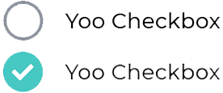

[](https://github.com/Yoonit-Labs/vue-yoonit-components)

# Vue Yoonit Components

[Home](https://github.com/Yoonit-Labs/vue-yoonit-components) | [Atoms](https://github.com/Yoonit-Labs/vue-yoonit-components/blob/feature/readme/README.md#atoms) | [Molecules](https://github.com/Yoonit-Labs/vue-yoonit-components/blob/feature/readme/README.md#molecules) | [Bosons](https://github.com/Yoonit-Labs/vue-yoonit-components/blob/feature/readme/README.md#bosons) | [Quarks](https://github.com/Yoonit-Labs/vue-yoonit-components/blob/feature/readme/README.md#quarks)

## YooCheckButton

## Usage

To use the component, simply invoke it in your template with the desired props

### Input
```vue
<template>
  <yoo-check-button
    text="Yoo Checkbox"
    size="medium"
    textPosition="left" 
  />
  <yoo-check-button
    text="Yoo Checkbox"
    size="medium"
    textPosition="left" 
    :checked:"true"
  />
  <yoo-check-button
    text="Yoo Checkbox"
    size="medium"
    textPosition="left"
    :card="true"
  />
  <yoo-check-button
    text="Yoo Checkbox"
    size="medium"
    textPosition="left"
    :card="true"
    :disable="true"
  />
</template>
```
### Output

The output of the above code will be:




### Props

| Parameter     | Type    | Default     | Valid values                                            | Description                                   | Required
|---------------|---------|-------------|---------------------------------------------------------|-----------------------------------------------|---------
| `size`        | String  | **medium** | <ul><li>small</li><li>medium</li><li>large</li><ul>     | Set the component size                        | false
| `tetPosition` | String  | **left** | <ul><li>left</li><li>right</li><ul>                     | Defines the position of the text in relation to the input | false
| `text`        | String  | ''          | Any string                                              | Defines the text for the component            | false
| `checked`     | Boolean | **false**   | true/false                                              | Defines the component as checked or not       | false
| `card`        | Boolean | **false**   | true/false                                              | Sets the component to be displayed as a card or not | false
| `disabled`    | Boolean | **false**   | true/false                                              | Disables the checkbutton                      | false

#

 #### [**Next component**](../Icon/README.md) :arrow_forward:

 #### :arrow_backward: [**Previous component**](../Button/README.md)
#
## To contribute and make it better

Clone the repo, change what you want and send PR.
For commit messages we use <a href="https://www.conventionalcommits.org/">Conventional Commits</a>.

Contributions are always welcome!

<a href="https://github.com/Yoonit-Labs/vue-yoonit-components/graphs/contributors">
  
</a>
  
---  

Code with ❤ by the [**Yoonit**](https://yoonit.dev/) Team
