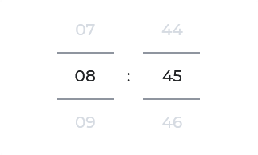

# Yonnit Components

[Home](https://github.com/Yoonit-Labs/vue-yoonit-components/blob/development/README.md) | [Atoms](https://github.com/Yoonit-Labs/vue-yoonit-components/blob/development/README.md#atoms) | [Molecules](https://github.com/Yoonit-Labs/vue-yoonit-components/blob/development/README.md#molecules) | [Bosons](https://github.com/Yoonit-Labs/vue-yoonit-components/blob/development/README.md#bosons) | [Quarks](https://github.com/Yoonit-Labs/vue-yoonit-components/blob/development/README.md#quarks)

## YooSelectDate

The component is used as a datetime picker

## Usage

To use the component, simply invoke it in your template with the desired props

### Input
```vue
<template>
  <yoo-select-date 
    type="time"
    value="13:44" />

  <yoo-select-date 
    type="date" 
    locale="en-us"
    value="1998-09-15" />

  <yoo-select-date 
    type="date" 
    locale="pt-br"
    value="15/09/1998" />
</template>
```
### Output

The output of the above code will be:




### Props

| Parameter | Type | Default | Valid values | Description | Required |
|-----------|------|------------------------|--------------|-------------|--
| `type`    | String | **date** | <ul><li>date</li><li>time</li><ul> | Sets the type of the component | false
| `value`   | String | **Current Date** | Supported formats: <ul><li>YYYY-mm-dd</li><li>dd/mm/YYYY</li><li>HH:mm</li></ul> | Sets initial value to date or time | false
| `locale`  | String | **pt-br** | Any locale notation. Ex.: `en-us`, `pt-br` | Sets the locale for date | false

#

 #### [**Next component**](../Separator/) :arrow_forward:
 
 #### :arrow_backward: [**Previous component**](../Icon/)

#

## To contribute and make it better

Clone the repo, change what you want and send PR.

Contributions are always welcome!

---

Code with ❤ by the [**Cyberlabs AI**](https://cyberlabs.ai/) Front-End Team
