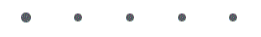

[](https://github.com/Yoonit-Labs/vue-yoonit-components)

# Vue Yoonit Components

[Home](https://github.com/Yoonit-Labs/vue-yoonit-components) | [Atoms](https://github.com/Yoonit-Labs/vue-yoonit-components/blob/feature/readme/README.md#atoms) | [Molecules](https://github.com/Yoonit-Labs/vue-yoonit-components/blob/feature/readme/README.md#molecules) | [Bosons](https://github.com/Yoonit-Labs/vue-yoonit-components/blob/feature/readme/README.md#bosons) | [Quarks](https://github.com/Yoonit-Labs/vue-yoonit-components/blob/feature/readme/README.md#quarks)

## YooStepper

The component is used to create steps (numbers or dots).

This issues and receives next or previous commands that can be created by the user or using the YooPagination component that is responsible for receiving the navigation buttons

## Usage

To use the component, simply invoke it in your template with the desired props

### Input
```vue
<template>
  <yoo-stepper
    counterType="number"
    :totalSteps="5"
  />
</template>
```
### Output

The output of the above code will be:


### Dots



### Props

| Parameter     | Type    | Default     | Valid values                         | Description                                        | Required
|---------------|---------|-------------|--------------------------------------|----------------------------------------------------|---------
| `counterType` | String  | **number**  | <ul><li>number</li><li>dot</li><ul>  | Sets the type of pagination the component will use | false
| `totalSteps`  | Number  | **1**       | Any positive number                  | Sets the total number of steps                     | false
| `currentStep` | Number  | **0**       | Any positive number                  | Set the current step                               | false

#

 #### [**Next component**](../Switch/README.md) :arrow_forward:
 
 #### :arrow_backward: [**Previous component**](../Separator/README.md)
#
## To contribute and make it better

Clone the repo, change what you want and send PR.
For commit messages we use <a href="https://www.conventionalcommits.org/">Conventional Commits</a>.

Contributions are always welcome!

<a href="https://github.com/Yoonit-Labs/vue-yoonit-components/graphs/contributors">
  
</a>
  
---  

Code with ❤ by the [**Yoonit**](https://yoonit.dev/) Team
