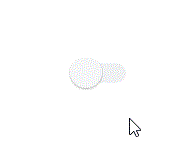

[](https://github.com/Yoonit-Labs/vue-yoonit-components)

# Vue Yoonit Components

[Home](https://github.com/Yoonit-Labs/vue-yoonit-components) | [Atoms](https://github.com/Yoonit-Labs/vue-yoonit-components/blob/feature/readme/README.md#atoms) | [Molecules](https://github.com/Yoonit-Labs/vue-yoonit-components/blob/feature/readme/README.md#molecules) | [Bosons](https://github.com/Yoonit-Labs/vue-yoonit-components/blob/feature/readme/README.md#bosons) | [Quarks](https://github.com/Yoonit-Labs/vue-yoonit-components/blob/feature/readme/README.md#quarks)

## YooSwitch

Component used to change the state of an item

## Usage

To use the component, simply invoke it in your template with the desired props

### Input
```vue
<template>
  <yoo-switch
    size="medium"
    :initialValue="false"
  />
</template>
```
### Output

The output of the above code will be:



### Props

| Parameter     | Type    | Default     | Valid values                                            | Description                                   | Required
|---------------|---------|-------------|---------------------------------------------------------|-----------------------------------------------|---------
| `size`        | String  | **medium**  | <ul><li>small</li><li>medium</li><li>large</li><ul>     | Sets size for the switch button               | false
| `initialValue`| Boolean | **false**   | true/false                                              | Sets the initial state of the switch (enabled / disabled) | false

#
 
 #### [**Next component**](../Tag/README.md) :arrow_forward:
 
 #### :arrow_backward: [**Previous component**](../Stepper/README.md)
#
## To contribute and make it better

Clone the repo, change what you want and send PR.
For commit messages we use <a href="https://www.conventionalcommits.org/">Conventional Commits</a>.

Contributions are always welcome!

<a href="https://github.com/Yoonit-Labs/vue-yoonit-components/graphs/contributors">
  
</a>
  
---  

Code with ❤ by the [**Yoonit**](https://yoonit.dev/) Team
