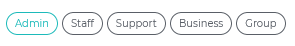
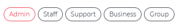
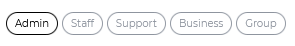

[](https://github.com/Yoonit-Labs/vue-yoonit-components)

# Vue Yoonit Components

[Home](https://github.com/Yoonit-Labs/vue-yoonit-components) | [Atoms](https://github.com/Yoonit-Labs/vue-yoonit-components/blob/feature/readme/README.md#atoms) | [Molecules](https://github.com/Yoonit-Labs/vue-yoonit-components/blob/feature/readme/README.md#molecules) | [Bosons](https://github.com/Yoonit-Labs/vue-yoonit-components/blob/feature/readme/README.md#bosons) | [Quarks](https://github.com/Yoonit-Labs/vue-yoonit-components/blob/feature/readme/README.md#quarks)

## YooTag

Component used for tag creation

## Usage

To use the component, simply invoke it in your template with the desired props

### Input
```vue
<template>
  <yoo-tag
    :tags='[{"name":"Admin","status":true},{"name":"Staff","status":false},{"name":"Support","status":false},{"name":"Business"},{"name":"Group"}]'
    fill="primary"
  />
  <yoo-tag
    :tags='[{"name":"Admin","status":true},{"name":"Staff","status":false},{"name":"Support","status":false},{"name":"Business"},{"name":"Group"}]'
    fill="danger"
  />
  <yoo-tag
    :tags='[{"name":"Admin","status":true},{"name":"Staff","status":false},{"name":"Support","status":false},{"name":"Business"},{"name":"Group"}]'
    fill="neutral"
  />
  <yoo-tag
    :tags='[{"name":"Admin","status":true},{"name":"Staff","status":false},{"name":"Support","status":false},{"name":"Business"},{"name":"Group"}]'
    fill="dark"
  />
  <yoo-tag
    :tags='[{"name":"Admin","status":true},{"name":"Staff","status":false},{"name":"Support","status":false},{"name":"Business"},{"name":"Group"}]'
    fill="black"
  />
</template>
```
### Output

The output of the above code will be:







### Props

| Parameter | Type          | Default     | Valid values                              | Description                                    | Required |
|-----------|---------------|-------------|-------------------------------------------|------------------------------------------------|----------|
| `tags`    | Array, String | ''          | `[{ name: 'Admin', status: true }, { name: 'Staff'}, { name: 'Support'}]` | Array or String to defined tags content  | true     |
| `fill`    | String        | **primary** | <ul><li>primary</li><li>danger</li><li>neutral</li><li>dark</li><li>black</li><li>white</li></ul> | Sets a color for text and border when item status in Array is true | false    |

#

 #### :arrow_backward: [**Previous component**](../Switch/README.md)
#
## To contribute and make it better

Clone the repo, change what you want and send PR.
For commit messages we use <a href="https://www.conventionalcommits.org/">Conventional Commits</a>.

Contributions are always welcome!

<a href="https://github.com/Yoonit-Labs/vue-yoonit-components/graphs/contributors">
  
</a>
  
---  

Code with ❤ by the [**Yoonit**](https://yoonit.dev/) Team
