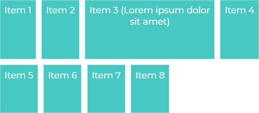

# Yoonit Components

[Home](https://github.com/Yoonit-Labs/vue-yoonit-components/blob/development/README.md) | [Atoms](https://github.com/Yoonit-Labs/vue-yoonit-components/blob/development/README.md#atoms) | [Molecules](https://github.com/Yoonit-Labs/vue-yoonit-components/blob/development/README.md#molecules) | [Bosons](https://github.com/Yoonit-Labs/vue-yoonit-components/blob/development/README.md#bosons) | [Quarks](https://github.com/Yoonit-Labs/vue-yoonit-components/blob/development/README.md#quarks)

## YooFlexLayout

Component used to assist in building layout based on Flex. You can align your content and organize in rows or columns in a simple way and still have some resources that will help you in the arrangement of the elements in your application.

## Usage

To use the component, simply invoke it in your template with the desired props

### Input
```vue
<template>
  <yoo-flex-layout
    flexDirection="row"
    flexWrap="wrap"
    justifyContent="flex-start"
    alignItems="stretch"
    alignContent="stretch"
    gap="10px"
  >
    <div>Item 1</div>
    <div>Item 2</div>
    <div>
      Item 3 (Lorem ipsum dolor
      <br />
      sit amet)
    </div>
    <div>Item 4</div>
    <div>Item 5</div>
    <div>Item 6</div>
    <div>Item 7</div>
    <div>Item 8</div>
  </yoo-flex-layout>
</template>
```
### Output

The output of the above code will be:



### Props

| Parameter     | Type    | Default     | Valid values                                            | Description                                   | Required
|---------------|---------|-------------|---------------------------------------------------------|-----------------------------------------------|---------
| `flexDirection` | String | **row** | <ul><li> row (same as text direction) </li><li> row-reverse (opposite to text direction) </li><li> column (same row but top to bottom) </li><li> column-reverse (same row-reverse but from top to bottom) </li></ul> | Defines the direction of the items inside the flex container. | false
| `flexWrap`    | String  | **nowrap** | <ul><li> nowrap (Does not allow line wrapping) </li><li> wrap (Wrap the line as soon as one of the flex items can no longer be compressed) </li><li> wrap-reverse ( Breaks the line as soon as one of the flex items can no longer be compressed. The break is in the opposite direction, that is to say the line above) </li></ul> | Defines whether the items should break the line or not. | false
| `justifyContent` | String | **flex-start** | <ul><li> flex-start (Aligns items to the beginning of the container) </li><li> flex-end (Aligns items to the end of the container) </li><li> center (Aligns items to the end of the container) center of the container) </li><li> space-between (Creates an equal spacing between the elements. Keeping the first glued at the beginning and the last at the end) </li><li> space-around (Creates a spacing between the elements. The middle spacing is twice as large as the beginning and end) </li></ul> | Aligns the flex items in the container according to the direction. | false
| `alignItems`  | String  | **stretch** | <ul><li> stretch (Default value, which makes flex items grow equally) </li><li> flex-start (Aligns items to the beginning) </li><li> flex-end ( Aligns items to the end) </li><li> center (Aligns items to the center) </li><li> baseline (Aligns items according to the typography's baseline) </li></ul> | The align-items aligns the flex items according to the container axis. The alignment is different for when items are in columns or rows. | false
| `alignContent` | String | **stretch** | <ul><li> stretch (Makes flex items grow equally vertically) </li><li> flex-start (Aligns all item lines to the beginning) </li><li> flex-end ( Aligns all lines of items to the end) </li><li> center (Aligns all lines of items to the center) </li><li> space-between (Creates equal spacing between lines. Keeping the first glued together at the top and the last at the bottom) </li><li> space-around (Creates a spacing between the lines. The middle spacing is twice as large as the top and bottom) </li></ul> | Aligns the container lines in relation to the vertical axis. The property only works if there is more than one line of flex-items. For this, the flex-wrap needs to be wrap. | false

### Child Props

| Parameter     | Type    | Default     | Valid values                                            | Description                                   | Required
|---------------|---------|-------------|---------------------------------------------------------|-----------------------------------------------|---------
| `order`       | Number | **0** | Any number (accepts negative numbers) | Modifies the order of flex items. Always from smallest to largest, like this: order: 1, appears in front of order: 5. | false
| `flexGrow`    | Number | **0** | Any number | Sets the ability of a flex item to grow. | false
| `flexShrink`  | Number | **1** | Any number | Sets the item's ability to downsize. | false
| `alignSelf`   | String | **auto** | <ul><li> auto (Respects what is defined by the align-items in the flex-container) </li><li> flex-start (Aligns the item to the beginning) </li><li> flex-end ( Aligns the item to the end) </li><li> center (Aligns the item to the center) </li><li> baseline (Aligns the item to the baseline) </li><li> stretch (Stretches the item ) </li></ul> | Defines a specific alignment of a single flex item within the flex container. If a value is assigned, it will override what is assigned in the flex container's `align-items`. | false
| `backgroundColor` | String | A valid color in RGB or Hexadecimal | Sets the background color for a flex item. | false
| `width`       | String | **auto** | A valid measure. i.e. 100px | Determines the width of an element's content area. | false
| `height`      | String | **auto** | A valid measure. i.e. 100px | Determines the height of an element's content area. | false

#
 
 #### :arrow_forward: [**Next component**](../GridLayout/README.md)

#

## To contribute and make it better

Clone the repo, change what you want and send PR.

Contributions are always welcome!

---

Code with ❤ by the [**Cyberlabs AI**](https://cyberlabs.ai/) Front-End Team
