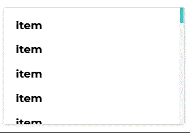
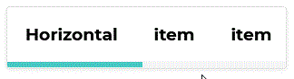

[](https://github.com/Yoonit-Labs/vue-yoonit-components)

# Vue Yoonit Components

[Home](https://github.com/Yoonit-Labs/vue-yoonit-components) | [Atoms](https://github.com/Yoonit-Labs/vue-yoonit-components/blob/feature/readme/README.md#atoms) | [Molecules](https://github.com/Yoonit-Labs/vue-yoonit-components/blob/feature/readme/README.md#molecules) | [Bosons](https://github.com/Yoonit-Labs/vue-yoonit-components/blob/feature/readme/README.md#bosons) | [Quarks](https://github.com/Yoonit-Labs/vue-yoonit-components/blob/feature/readme/README.md#quarks)

## YooScrollView

Component used to assist in building layout based on Grid. You can align your content and organize in rows or columns in a simple way and still have some resources that will help you in the arrangement of the elements in your application.

## Usage

To use the component, simply invoke it in your template with the desired props

### Input
```vue
<template>
  <yoo-scroll-view
    orientation="vertical"
  >
    <template v-slot>
      <h3>item</h3>
      <h3>item</h3>
      <h3>item</h3>
      <h3>item</h3>
      <h3>item</h3>
      <h3>item</h3>
      <h3>item</h3>
      <h3>Final</h3>
    </template>
  </yoo-scroll-view>
</template>
```
### Output

The output of the above code will be:

#### Vertical


#### Horizontal


### Props

| Parameter     | Type    | Default      | Valid values                                            | Description                                   | Required
|---------------|---------|--------------|---------------------------------------------------------|-----------------------------------------------|---------
| `orientation` | String  | **vertical** | <ul><li> horizontal (Creates the scroll bar horizontally) </li><li> vertical (creates the scroll bar vertically) </li></ul> | Defines the scroll direction | false

#
 
#### :arrow_backward: [**Previous component**](../GridLayout/README.md)
#
## To contribute and make it better

Clone the repo, change what you want and send PR.
For commit messages we use <a href="https://www.conventionalcommits.org/">Conventional Commits</a>.

Contributions are always welcome!

<a href="https://github.com/Yoonit-Labs/vue-yoonit-components/graphs/contributors">
  
</a>
  
---  

Code with ❤ by the [**Yoonit**](https://yoonit.dev/) Team
