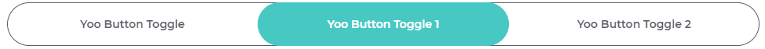

# Yonnit Components

[Home](https://cyberlabs.ai/) | [Atoms](https://cyberlabs.ai/) | [Molecules](https://cyberlabs.ai/) | [Bosons](https://cyberlabs.ai/) | [Quarks](https://cyberlabs.ai/)

## YooButton

The component is used to render a toggle button, being possible to inform the number of buttons that will be rendered, being at least two.

## Usage

To use the component, simply invoke it in your template with the desired props.

### Input
`App.vue`
```vue
<template>
  <yoo-button-toggle
    :options='["Yoo Button Toggle","Yoo Button Toggle 1"," Yoo Button Toggle 2"]'
    :current="1"
  />
</template>
```

### Output

The output of the above code will be:



### Props

| Name               | Input/Format                                  | Description                                                                 |
| -                  | -                                             | -                                                                           |
| options            | array                                         | Set the number of buttons to be rendered and their  names                                                      |
| current            | number                                        | Arrow which button is active          |

## To contribute and make it better

Clone the repo, change what you want and send PR.

Contributions are always welcome!

---

Code with ❤ by the [**Cyberlabs AI**](https://cyberlabs.ai/) Front-End Team