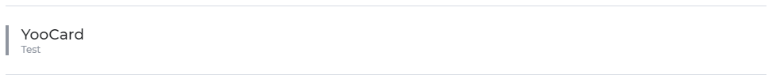

# Yonnit Components

[Home](https://cyberlabs.ai/) | [Atoms](https://cyberlabs.ai/) | [Molecules](https://cyberlabs.ai/) | [Bosons](https://cyberlabs.ai/) | [Quarks](https://cyberlabs.ai/)

## YooCard

The component renders a card with title and subtitle, being able to receive a border on the left as customization

## Usage

To use the component, simply invoke it in your template with the desired props.

### Input
`App.vue`
```vue
<template>
  <yoo-card
    title="YooCard"
    subtitle="Test"
    justifySlotContent="flex-start"
    borderLeft
    borderFill="neutral"
  />
</template>
```

### Output

The output of the above code will be:



### Props

| Name               | Input/Format                                  | Description                                                                 |
| -                  | -                                             | -                                                                           |
| borderLeft         | boolean                                       | Arrow if the left edge of the card will be used or not                      |
| justifySlotContent | flex-start, flex-end, center, space-between, space-around | Set the component size                                                      |
| borderFill         | neutral, primary, danger, light, dark, darkest| Sets the color of the left edge of the card                                 |
| title              | string                                        | Sets the card title value                                                   |
| subtitle           | string                                        | Set the card subtitle value                                                 |

## To contribute and make it better

Clone the repo, change what you want and send PR.

Contributions are always welcome!

---

Code with ❤ by the [**Cyberlabs AI**](https://cyberlabs.ai/) Front-End Team