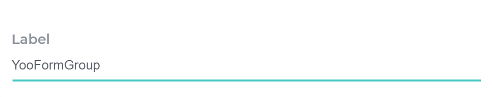

[](https://github.com/Yoonit-Labs/vue-yoonit-components)

# Vue Yoonit Components

[Home](https://github.com/Yoonit-Labs/vue-yoonit-components) | [Atoms](https://github.com/Yoonit-Labs/vue-yoonit-components/blob/feature/readme/README.md#atoms) | [Molecules](https://github.com/Yoonit-Labs/vue-yoonit-components/blob/feature/readme/README.md#molecules) | [Bosons](https://github.com/Yoonit-Labs/vue-yoonit-components/blob/feature/readme/README.md#bosons) | [Quarks](https://github.com/Yoonit-Labs/vue-yoonit-components/blob/feature/readme/README.md#quarks)

## YooFormGroup

The component renders a text input.

## Usage

To use the component, simply invoke by passing the information in your props.

### Input
`App.vue`
```vue
<template>
  <yoo-form-group
    label="Label"
    value=""
    :required="false"
    :disabled="false"
    validateOnDataInput
    placeholder="Placeholder"
  />
</template>
```

### Output

The output of the above code will be:


### Valid



### Invalid


### Disabled


### Props

| Parameter | Type | Default | Valid values | Description | Required |
|-----------|------|------------------------|--------------|-------------|---------|
| **`label`** | String | `''` | Any String | Informs the label of the input. | false |
| **`value`** | String | `''` | Any String | Informs the value of the input. | false |
| **`required`** | Boolean | `''` | `true` or `false` | Tells whether value is required. | false |
| **`validateOnDataInput`** | Boolean | `false` | `true` or `false` | Informs if the value received in the value field is valid. | false |
| **`requiredRule`** | Function | `''` | i.e let result = result.length > 3 ? true : false | Reports the component validation rule | false |
| **`disabled`** | Boolean | `''` | `true` or `false` | Informs if the input is enabled. | false |


#### [**Next component**](../Header/README.md) :arrow_forward:

#### :arrow_backward: [**Previous component**](../Card/README.md)
#
## To contribute and make it better

Clone the repo, change what you want and send PR.
For commit messages we use <a href="https://www.conventionalcommits.org/">Conventional Commits</a>.

Contributions are always welcome!

<a href="https://github.com/Yoonit-Labs/vue-yoonit-components/graphs/contributors">
  
</a>
  
---  

Code with ❤ by the [**Yoonit**](https://yoonit.dev/) Team
