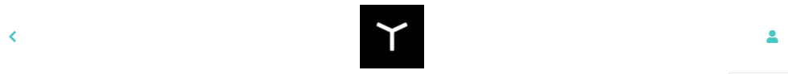
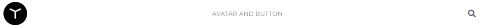

# Yonnit Components

[Home](https://cyberlabs.ai/) | [Atoms](https://cyberlabs.ai/) | [Molecules](https://cyberlabs.ai/) | [Bosons](https://cyberlabs.ai/) | [Quarks](https://cyberlabs.ai/)

## YooHeader

The component is used to render a header, receiving three slots, which can be customized according to the need for use.

## Usage

To use the component, you must inform what should be rendered in each slot. The use of the three slots is not mandatory, and only one or two can be used, according to the need.

### Input
`App.vue`
```vue
<template>
  <yoo-header>
    <template v-slot:header-left>
      <yoo-button text="" icon="chevron-left" variation="clear"></yoo-button>
    </template>

    <template v-slot:header-center>
      HEADER
    </template>

    <template v-slot:header-right>
      <yoo-button text="" icon="user" variation="clear"></yoo-button>
    </template>
  </yoo-header>
</template>
```

### Output

The output of the above code will be:


### Image



### Avatar



### Slots

| Slot | Type | Description |
|-----------|------|------------------------|
| **`header-left`** | Any | Render the element in the left slot of the header. | 
| **`header-center`** | Any |Render the element in the middle slot of the header. |
| **`header-right`** | Any | Render the element in the right slot of the header. |

#### [**Next component**](../Modal/README.md) :arrow_forward:

#### :arrow_backward: [**Previous component**](../FormGroup/README.md)

## To contribute and make it better
## To contribute and make it better

Clone the repo, change what you want and send PR.

Contributions are always welcome!

---

Code with ❤ by the [**Cyberlabs AI**](https://cyberlabs.ai/) Front-End Team