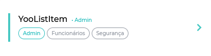
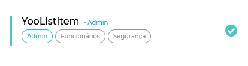
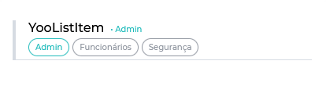

[](https://github.com/Yoonit-Labs/vue-yoonit-components)

# Vue Yoonit Components

[Home](https://github.com/Yoonit-Labs/vue-yoonit-components) | [Atoms](https://github.com/Yoonit-Labs/vue-yoonit-components/blob/feature/readme/README.md#atoms) | [Molecules](https://github.com/Yoonit-Labs/vue-yoonit-components/blob/feature/readme/README.md#molecules) | [Bosons](https://github.com/Yoonit-Labs/vue-yoonit-components/blob/feature/readme/README.md#bosons) | [Quarks](https://github.com/Yoonit-Labs/vue-yoonit-components/blob/feature/readme/README.md#quarks)

## YooListItem

The component renders an item from a list.

## Usage

To use the component, you must inform all the props you want to use, and also, it has a slot that will be rendered at the end of the component, which is optional.

### Input
`App.vue`
```vue
<template>
  <yoo-list-item
    title="YooListItem"
    subtitle="• Admin"
    :tags='[{"name":"Admin","status":true},{"name":"Funcionários"},{"name":"Segurança"}]'
    actionableType="button"
    borderFill="neutral"
  />
</template>
```

### Output

The output of the above code will be:


### Border Left


### Button



### Checkbox Unchecked


### Checkbox Checked



### Separator



### Slots

| Slot | Type | Description |
|-----------|------|------------------------|
| **`header-left`** | Any | Render the element in the left slot of the header. |

### Props

| Parameter | Type | Default | Valid values | Description | Required |
|-----------|------|------------------------|--------------|-------------|---------|
| **`tags`** | Array Object | `''` | i.e tags: [{ name: 'Admin', status: true }, { name: 'Funcionários' }] | Informs the tags that will be rendered. | false |
| **`title`** | String | `''` | Any String | Report or title that will be rendered non-component. | false |
| **`subtitle`** | String | `''` | Any String | Report or subtitle that will be rendered non-component. | false |
| **`actionable`** | Boolean | `false` | `true` or `false` | Indicates whether to render a call to action element. | false |
| **`actionableType`** | String | `button` | `button` or `check` | Choose whether the call to action will be a button or a checkbox. | false |
| **`actionableActive`** | Boolean | `false` | `true` or `false` | Tells whether the 'check' type of call to action will have the initial value checked. | false |
| **`borderLeft`** | Boolean | `false` | `true` or `false` | Tells whether the component's left border will be rendered. | false |
| **`borderFill`** | String | `neutral` | `neutral`, `primary`, `danger`, `light`, `dark` or `darkest` | Informs the value of the left border. | false |
| **`buttonDisable`** | Boolean | `false` | `true` or `false` | Indicates whether call to action is disabled or not. | false |
| **`separator`** | Boolean | `false` | `true` or `false` | Tells whether a bottom border will be rendered for component separation. | false |

#### [**Next component**](../Modal/README.md) :arrow_forward:

#### :arrow_backward: [**Previous component**](../Header/README.md)
#
## To contribute and make it better

Clone the repo, change what you want and send PR.
For commit messages we use <a href="https://www.conventionalcommits.org/">Conventional Commits</a>.

Contributions are always welcome!

<a href="https://github.com/Yoonit-Labs/vue-yoonit-components/graphs/contributors">
  
</a>
  
---  

Code with ❤ by the [**Yoonit**](https://yoonit.dev/) Team
