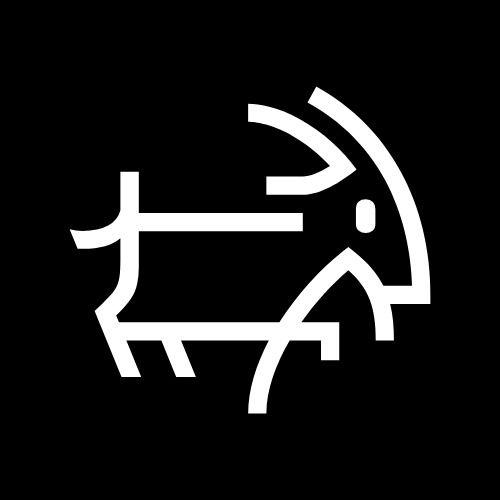

[](https://github.com/Yoonit-Labs/vue-yoonit-components)

# Vue Yoonit Components

[Home](https://github.com/Yoonit-Labs/vue-yoonit-components) | [Atoms](https://github.com/Yoonit-Labs/vue-yoonit-components/blob/feature/readme/README.md#atoms) | [Molecules](https://github.com/Yoonit-Labs/vue-yoonit-components/blob/feature/readme/README.md#molecules) | [Bosons](https://github.com/Yoonit-Labs/vue-yoonit-components/blob/feature/readme/README.md#bosons) | [Quarks](https://github.com/Yoonit-Labs/vue-yoonit-components/blob/feature/readme/README.md#quarks)

## YooModal

The component is used to render a modal in the application.

## Usage

To use the component, you must inform what should be rendered in the slot. Render a template as a dynamic component.

### Input
`App.vue`
```vue
```

### Output

The output of the above code will be:


### Slots

| Name Slot | Type | Default | Valid values | Description |
|-----------|------|------------------------|--------------|-------------|
| **`modal`** | slot | `''` | Any template | Receive the template that will be rendered within the modal. |

#### [**Next component**](../Modal/README.md) :arrow_forward:

#### :arrow_backward: [**Previous component**](../Header/README.md)
#
## To contribute and make it better

Clone the repo, change what you want and send PR.
For commit messages we use <a href="https://www.conventionalcommits.org/">Conventional Commits</a>.

Contributions are always welcome!

<a href="https://github.com/Yoonit-Labs/vue-yoonit-components/graphs/contributors">
  
</a>
  
---  

Code with ❤ by the [**Yoonit**](https://yoonit.dev/) Team
