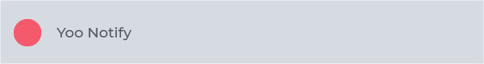

[](https://github.com/Yoonit-Labs/vue-yoonit-components)

# Vue Yoonit Components

[Home](https://github.com/Yoonit-Labs/vue-yoonit-components) | [Atoms](https://github.com/Yoonit-Labs/vue-yoonit-components/blob/feature/readme/README.md#atoms) | [Molecules](https://github.com/Yoonit-Labs/vue-yoonit-components/blob/feature/readme/README.md#molecules) | [Bosons](https://github.com/Yoonit-Labs/vue-yoonit-components/blob/feature/readme/README.md#bosons) | [Quarks](https://github.com/Yoonit-Labs/vue-yoonit-components/blob/feature/readme/README.md#quarks)

## YooNotify

Component used to display a notification space to the user

## Usage

To use the component, simply invoke it in your template with the desired props

### Input
```vue
<template>
  <yoo-notify
    notifyFill="light"
    notifyText="This is an example text from YooNotify"
    notifyTextColor="dark"
    notifyTextSize="md"
    :showIndicator="false"
    :showIcon="false"
    :closeButton="false"
  />
  <yoo-notify
    notifyFill="light"
    notifyText="This is an example text from YooNotify"
    notifyTextColor="dark"
    notifyTextSize="md"
    :showIndicator="false"
    :showIcon="false"
    :closeButton="true"
  />
  <yoo-notify
    notifyFill="light"
    notifyText="This is an example text from YooNotify"
    notifyTextColor="dark"
    notifyTextSize="md"
    :showIndicator="true"
    :showIcon="false"
    :closeButton="false"
  />
  <yoo-notify
    notifyFill="light"
    notifyText="This is an example text from YooNotify"
    notifyTextColor="dark"
    notifyTextSize="md"
    :showIndicator="false"
    :showIcon="true"
    icon="cog"
    iconStyle="solid"
    iconColor="dark"
  />
  <yoo-notify
    notifyFill="light"
    notifyText="This is an example text from YooNotify"
    notifyTextColor="dark"
    notifyTextSize="md"
    :showIndicator="true"
    :showIcon="false"
    :closeButton="true"
  />
</template>
```
### Output

The output of the above code will be:



### Props

| Parameter          | Type    | Default | Valid values                              | Description                                    | Required |
|--------------------|---------|---------|-------------------------------------------|------------------------------------------------|----------|
| `title`              | String  |   **''**    | Any String                                | Sets the component item title                  | false    |
| `notifyText`         | String  |   **''**    | Any String                                | Sets the component item text                   | false    |
| `notifyTextColor`    | String  | **dark**    | <ul><li>dark</li><li>light</li><li>danger</li></ul> | Sets a color for component text   | false    |
| `notifyTextSize`     | String  | **md**      | <ul><li>tn</li><li>xs</li><li>sm</li><li>md</li><li>lg</li><li>xl</li><li>hg</li></ul>  | Set a size for the component text     | false    |
| `notifyFill`         | String  | **light**   | <ul><li>light</li><li>primary</li><li>danger</li></ul>                    | Set a background color                         | false    |
| `showIndicator`      | Boolean | **true**    | true/false                                | Shows the indicator component                  | true     |
| `indicatorSize`      | String  | **large**  | <ul><li>small</li>, <li>medium</li> <li>large</li> <li>extra-large</li>              | Set a size for the indicator                   | false    |
| `indicatorFill`      | String  | **danger**  | <ul><li>primary</li>, <li>danger</li> <li>light</li> <li>dark</li> <li>neutral</li>     | Set a color for the indicator                  | false    |
| `showIcon`           | Boolean |  **false**  | true/false                                | When there is no indicator, enable the icon    | false    |
| `icon`               | String  |   **''**    | Any icon related to fontawesome           | Sets an icon on the button based on fontawesome| false    |
| `iconColor`          | String  | **dark**    | <ul><li>light</li><li>dark</li>           | Sets a color for the icon                      | false    |
| `iconStyle`          | String  | **solid**   | <ul><li>solid</li><li>regular</li>        | Sets the icon type to filled or bordered only  | false    |
| `closeButton`        | Boolean | **false**   | true/false                                | Sets a close button for the component          | false    |
| `buttonColor`        | String  |   **''**    | Any color i.e #00000                      | Set a color to the close button                | false    |
#

 #### [**Next component**](../Modal/Modal.readme.md) :arrow_forward:

 #### :arrow_backward: [**Previous component**](../Pagination/Pagination.readme.md)
#
## To contribute and make it better

Clone the repo, change what you want and send PR.
For commit messages we use <a href="https://www.conventionalcommits.org/">Conventional Commits</a>.

Contributions are always welcome!

<a href="https://github.com/Yoonit-Labs/vue-yoonit-components/graphs/contributors">
  
</a>
  
---  

Code with ❤ by the [**Yoonit**](https://yoonit.dev/) Team
