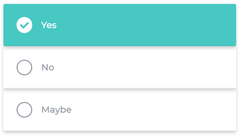
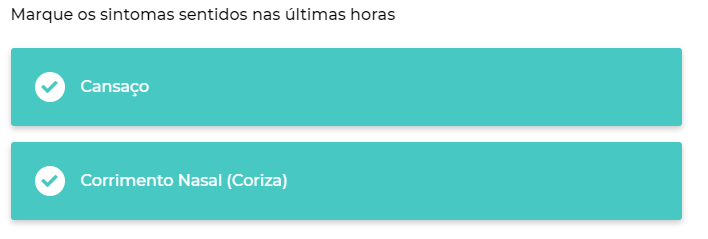

# Yonnit Components

[Home](https://cyberlabs.ai/) | [Atoms](https://cyberlabs.ai/) | [Molecules](https://cyberlabs.ai/) | [Bosons](https://cyberlabs.ai/) | [Quarks](https://cyberlabs.ai/)

## YooQuizQuestions

The component renders a list of options to be selected.

## Usage

To use the component, simply invoke by passing the information in your props, question and answers.

### Input
`App.vue`
```vue
<template>
  <yoo-quiz-question
    textPosition="left"
    :question='{"id":"yoonit-cl1","text":{"enUS":"Are you enjoying using Yoonit Components"},"visible":true,"type":"radio","answers":[{"id":"ans1","text":{"enUS":"Yes"},"weight":3},{"id":"ans2","text":{"enUS":"No"},"weight":3,"status":true,"override":false}]}'
    :answers='[{"id":"ans1","text":{"enUS":"Yes"},"weight":3},{"id":"ans2","text":{"enUS":"No"},"weight":3,"status":true,"override":false}]'
  />
</template>
```

### Output

The output of the above code will be:



### Checkbox



### Props

| Parameter | Type | Default | Valid values | Description | Required |
|-----------|------|------------------------|--------------|-------------|---------|
| **`textPosition`** | String | `left` | <ul><li>left</li></ul><ul><li>right</li></ul> | Position of text in the component. | false |
| **`question`** | Object | `''` | i.e {"id":"yoonit-cl1","text":{"enUS":"Are you enjoying using Yoonit Components"},"visible":true,"type":"radio","answers":[{"id":"ans1","text":{"enUS":"Yes"},"weight":3},{"id":"ans2","text":{"enUS":"No"},"weight":3,"status":true,"override":false}]} | Object with the questions that will be rendered. | true |

#### [**Next component**](../SegmentedBar/README.md) :arrow_forward:

#### :arrow_backward: [**Previous component**](../PostCard/README.md)
## To contribute and make it better

Clone the repo, change what you want and send PR.

Contributions are always welcome!

---

Code with ❤ by the [**Cyberlabs AI**](https://cyberlabs.ai/) Front-End Team

