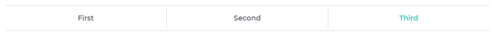

# Yonnit Components

[Home](https://cyberlabs.ai/) | [Atoms](https://cyberlabs.ai/) | [Molecules](https://cyberlabs.ai/) | [Bosons](https://cyberlabs.ai/) | [Quarks](https://cyberlabs.ai/)

## YooSegmentedBar

The component is used to render a segmented navigation bar.

## Usage

To use the component, you must inform the na prop list the number of items that will be rendered.

### Input
`App.vue`
```vue
<template>
  <yoo-segmented-bar
    :list='[{"title":"First"},{"title":"Second"},{"title":"Third"}]'
    :currentIndex="2"
  />
</template>
```

### Output

The output of the above code will be:



### Props

| Name               | Input/Format                                  | Description                                                                 |
| -                  | -                                             | -                                                                           |
| list               | array                                         | List of items to be rendered                                                                         |
| current            | number                                        | Item that is selected                                                       |

## To contribute and make it better

Clone the repo, change what you want and send PR.

Contributions are always welcome!

---

Code with ❤ by the [**Cyberlabs AI**](https://cyberlabs.ai/) Front-End Team