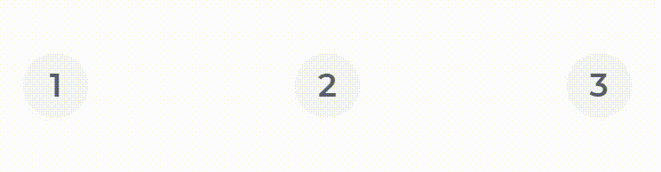

# Yonnit Components

[Home](https://cyberlabs.ai/) | [Atoms](https://cyberlabs.ai/) | [Molecules](https://cyberlabs.ai/) | [Bosons](https://cyberlabs.ai/) | [Quarks](https://cyberlabs.ai/)

## YooSelectButton

The component renders buttons to be selected

## Usage

To use the component, simply invoke by passing the information in your props, and it can be used as a single or multiple selection

### Input
`App.vue`
```vue
<template>
  <yoo-select-button
    :options='[{"text":"1","value":1},{"text":"2","value":2},{"text":"3","value":3}]'
  />

  <yoo-select-button
    :options='[{"text":"1","value":1},{"text":"2","value":2},{"text":"3","value":3}]'
    multiple="true"
  />
</template>
```

### Output

The output of the above code will be:

### Default




### Multiple


### Props

| Parameter | Type | Default | Valid values | Description | Required |
|-----------|------|------------------------|--------------|-------------|---------|
| **`options`** | Array | `''` | Array of objects i.e [{"text": "1", "value": 1}] | Informs the items that will be rendered. | true
| **`multiple`** | Boolean | `false` | <ul><li>true</li></ul><ul><li>false</li></ul> | Shows whether it will be possible to select more than one option. | false

#### [**Next component**](../TableAttribute/README.md) :arrow_forward:

#### :arrow_backward: [**Previous component**](../SegmentedBar/README.md)

## To contribute and make it better

Clone the repo, change what you want and send PR.

Contributions are always welcome!

---

Code with ❤ by the [**Cyberlabs AI**](https://cyberlabs.ai/) Front-End Team

