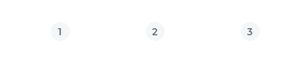
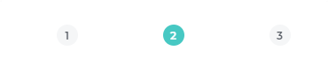
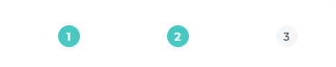
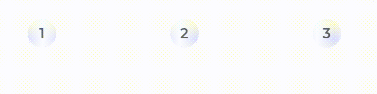

# Yonnit Components

[Home](https://cyberlabs.ai/) | [Atoms](https://cyberlabs.ai/) | [Molecules](https://cyberlabs.ai/) | [Bosons](https://cyberlabs.ai/) | [Quarks](https://cyberlabs.ai/)

## YooSelectButton

The component renders buttons to be selected

## Usage

To use the component, simply invoke by passing the information in your props, and it can be used as a single or multiple selection

### Input
`App.vue`
```vue
<template>
  <yoo-select-button
    :options='[{"text":"1","value":1},{"text":"2","value":2},{"text":"3","value":3}]'
  />

  <yoo-select-button
    :options='[{"text":"1","value":1},{"text":"2","value":2},{"text":"3","value":3}]'
    multiple
  />
</template>
```

### Output

The output of the above code will be:





### Demo Default




### Demo Multiple


### Props

| Name               | Input/Format                                  | Description                                                                 |
| -                  | -                                             | -                                                                           |
| textPosition       | left, right                                   | Position of text in the component                                           |
| question           | object                                        | Object with the questions that will be rendered                             |     

## To contribute and make it better

Clone the repo, change what you want and send PR.

Contributions are always welcome!

---

Code with ❤ by the [**Cyberlabs AI**](https://cyberlabs.ai/) Front-End Team

